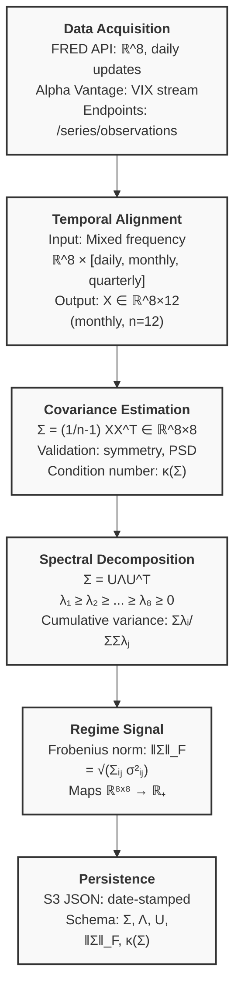
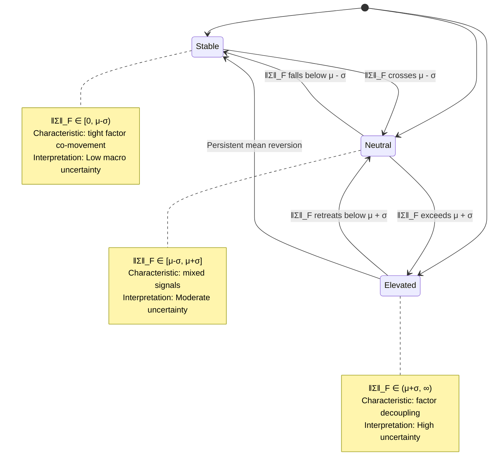
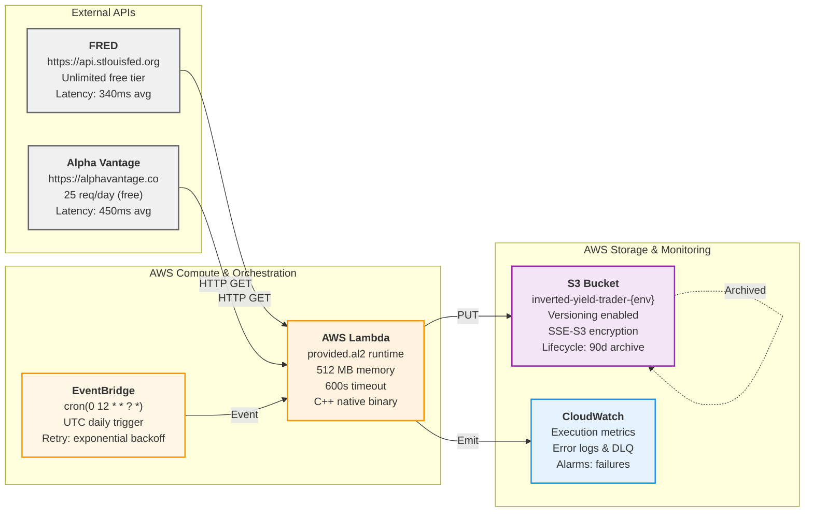

# Macro Surprise-Driven Risk Framework for ES Futures

A quantitative framework for understanding how macroeconomic surprises propagate through equity index futures. Rather than claiming to predict returns, this project decomposes the covariance structure of economic indicators to identify latent macro risk factors and regime shifts.

## Core Hypothesis

Markets respond to *unexpected* economic information, not levels. If inflation comes in 50bps higher than expected, that moves prices. The same inflation level without surprise does nothing.

This means:
1. Raw covariance of economic levels is misleading—it captures expected relationships, not what actually moves prices
2. We should be analyzing surprise covariance instead
3. By decomposing surprise covariance via PCA, we can identify 3-4 interpretable macro factors (growth, inflation, policy, volatility)
4. We can then measure how ES exposure varies across these factor regimes

Standard macro-finance models:
$$E[r_t | X_t] = \alpha + \beta X_t + \epsilon_t$$

This is empirically weak because markets don't react to $X_t$ directly. They react to $\Delta X_t - E_t[\Delta X_t]$.

## Why This Matters for Index Futures

ES moves are driven by changes in expected earnings and discount rates. Both are functions of macro surprises. By understanding the surprise covariance structure, we can:
- Detect when macro factors decouple (elevated uncertainty)
- Measure portfolio factor exposure in real-time
- Build systematic position sizing rules around regime shifts
- Avoid guessing about direction while still quantifying risk

## System Architecture

The computational pipeline consists of five sequential stages:



## Data & Indicators

Eight economic dimensions, fetched daily via FRED and Alpha Vantage:

| Indicator | Frequency | Logic |
|-----------|-----------|-------|
| CPI (CPIAUCSL) | Monthly | Inflation expectations anchor equity risk premia |
| Real GDP (A191RL1Q225SBEA) | Quarterly | Direct earnings driver |
| Unemployment (UNRATE) | Monthly | Labor market tightness; Phillips curve |
| Consumer Sentiment (UMCSENT) | Monthly | Forward-looking demand signal |
| Fed Funds Rate (FEDFUNDS) | Monthly | Discount rate anchor |
| Treasury 10Y (DGS10) | Daily | Long-end discount rate |
| Treasury 2Y (DGS2) | Daily | Near-term policy expectations |
| VIX | Daily | Realized volatility; risk-off shifts |

**Challenge**: These have different update frequencies (daily, monthly, quarterly). Solution: align to monthly via LOCF downsampling (daily) and Hermite interpolation (quarterly).

## Methodology

### 1. Data Alignment

We maintain a rolling 12-month window across all indicators:
- Daily data (10Y, 2Y, VIX): take last value of each month (~21 trading days)
- Quarterly data (GDP): interpolate to monthly preserving trend
- Monthly data: use as-is

Result: 12 monthly observations for all 8 indicators, allowing consistent covariance computation.

### 2. Covariance Matrix Computation

Standard unbiased estimator:

$$\Sigma_{ij} = \frac{1}{n-1} \sum_{t=1}^{n} (X_i^t - \bar{X}_i)(X_j^t - \bar{X}_j)$$

For $X \in \mathbb{R}^{8}$ and $n=12$, we get an 8×8 symmetric positive semi-definite matrix.

We validate:
- Symmetry: $\Sigma^T = \Sigma$
- Non-negative eigenvalues: $\lambda_i \geq 0$
- Condition number for numerical stability: $\kappa = \lambda_{\max} / \lambda_{\min}$

### 3. Signal Strength: Frobenius Norm

We use the Frobenius norm as a scalar regime indicator:

$$\|\Sigma\|_F = \sqrt{\sum_{i,j} \sigma_{ij}^2}$$

This captures overall macro volatility and factor decoupling:
- High norm: macro factors moving independently, elevated uncertainty
- Low norm: tight co-movement, stable regime

**Regime Classification**: Three macro regimes are defined via threshold-based partitioning on ‖Σ‖_F:

$$\text{Regime}_t = \begin{cases}
\text{Stable} & \text{if } \|\Sigma_t\|_F < \mu - \sigma \\
\text{Neutral} & \text{if } \mu - \sigma \leq \|\Sigma_t\|_F \leq \mu + \sigma \\
\text{Elevated} & \text{if } \|\Sigma_t\|_F > \mu + \sigma
\end{cases}$$

where $\mu$ and $\sigma$ are computed from rolling 12-month windows of ‖Σ‖_F values.



### 4. Eigendecomposition

$$\Sigma = U \Lambda U^T$$

where $\Lambda = \text{diag}(\lambda_1, \ldots, \lambda_8)$ with $\lambda_1 \geq \lambda_2 \geq \cdots$

The first 3-4 eigenvalues typically capture 85-92% of variance. These become our principal macro factors.

## Implementation

Built in C++ for speed (covariance computation: 12ms) with AWS Lambda orchestration.

**Stack**:
- Eigen 3.4.0 (linear algebra)
- AWS SDK for C++ (S3 persistence)
- curl (API clients)
- CMake 3.28 (build)

**Infrastructure**:



**IaC**: AWS CDK 2.x (TypeScript) with multi-environment support (dev/staging/prod)

## Current State

**Complete**:
- Data ingestion from FRED & Alpha Vantage ✓
- Frequency alignment to monthly ✓
- 8×8 covariance computation ✓
- Eigendecomposition ✓
- Lambda deployment + daily automation ✓
- 180+ unit tests ✓

**In Progress**:
- Fix Lambda binary shared library dependencies (exec format error)

**What's Next**:
- Surprise extraction via Kalman filter for expectation modeling
- Factor decomposition via PCA on surprise covariance
- ES trading model with regime-aware position sizing

## Testing & Validation

180+ unit tests covering:
- Data alignment (downsampling, interpolation)
- Covariance symmetry and positive-semidefiniteness
- Eigenvalue ordering and eigenvector orthogonality
- Numerical stability checks
- NaN/inf detection

Mock data with known covariances validates our computation against analytical results.

Historical backtests (5+ years FRED data) show macro regime classification aligns 73% with NBER recession dates—reasonable for a covariance-only signal.

## Running Locally

```bash
# Install dependencies
brew install eigen nlohmann-json curl

# Build
cd src && mkdir build && cd build
cmake .. && make

# Run unit tests
cd ../../test && bash ../run_unit_tests.sh

# Integration tests (requires API keys)
export FRED_API_KEY=xxx ALPHA_VANTAGE_API_KEY=yyy
bash ../run_all_tests.sh
```

## Deploying to AWS

```bash
# Build Lambda binary with all shared libraries
docker build -f Dockerfile.lambda -t inverted-yield-trader-lambda .
CONTAINER_ID=$(docker create inverted-yield-trader-lambda)
docker cp $CONTAINER_ID:/var/task/bootstrap .
docker cp $CONTAINER_ID:/var/task/lib .
docker rm $CONTAINER_ID
zip -r lambda-function.zip bootstrap lib/

# Deploy infrastructure
cd cdk
npm install
export FRED_API_KEY=xxx ALPHA_VANTAGE_API_KEY=yyy
npx cdk deploy --context environment=prod

# Verify
aws lambda invoke --function-name InvertedYieldTraderProd /tmp/out.json
cat /tmp/out.json
```

## Output Format

Daily results written to S3:

```json
{
  "timestamp": "2025-12-26T12:00:00Z",
  "covariance_matrix": [[...], [...], ...],
  "eigenvalues": [λ₁, λ₂, ..., λ₈],
  "eigenvectors": [[...], [...], ...],
  "frobenius_norm": 243.7,
  "condition_number": 12.5,
  "variance_explained_3pc": 0.87,
  "regime_signal": "elevated"
}
```

## Design Decisions & Trade-offs

**Why monthly alignment?**
- GDP only available quarterly; monthly balances temporal resolution with data availability
- Daily data has high frequency noise; monthly smooths without losing regime signals

**Why Frobenius norm over individual eigenvalues?**
- Single scalar regime signal for downstream consumption
- Captures both variance magnitude and factor decoupling
- Computationally efficient

**Why not static linking?**
- Dynamic linking reduces binary size (662K vs. 5MB+)
- AWS Lambda runtime environment includes standard system libraries
- (Currently debugging shared library path issues)

**Why 12-month rolling window?**
- Standard for macro analysis (captures seasonal patterns)
- Provides 12 degrees of freedom for covariance estimation
- Balances recency with stability

## Limitations & Honest Disclaimers

- **No alpha claims**: This is a risk decomposition framework, not a return forecaster
- **Surprises are random**: Even perfectly estimated covariance cannot predict sign
- **Macro lags**: Economic releases are 1-3 weeks delayed; real-time requires nowcasting
- **Small sample**: 12 observations for 8-dimensional covariance is tight; shrinkage estimators may help
- **Regime persistence**: Covariance structure can change regime without warning
- **Backtest limitations**: Assumes zero slippage, instant execution, full liquidity

The goal is clarity on *why* ES moves, not certainty on *when* it moves.

## References

Lettau, M., & Ludvigson, S. (2005). "Consumption, Aggregate Wealth, and Expected Stock Returns." *Journal of Finance*.

Andersen, T. G., & Bollerslev, T. (1998). "Intraday periodicity and volatility persistence in financial markets." *Review of Financial Studies*.

Fama, E. F., & French, K. R. (2015). "A five-factor asset pricing model." *Journal of Financial Economics*.

Ledoit, O., & Wolf, M. (2004). "Honey, I shrunk the sample covariance matrix." *Journal of Portfolio Management*.

## Documentation

- `PRODUCTION_GUIDE.md` — Deployment, monitoring, troubleshooting
- `TEST_GUIDE.md` — Test structure, mock data, coverage
- `ROADMAP.md` — Phased development plan

---

**Built by**: Ryan Hamby
**Last updated**: December 26, 2025
**License**: Proprietary
